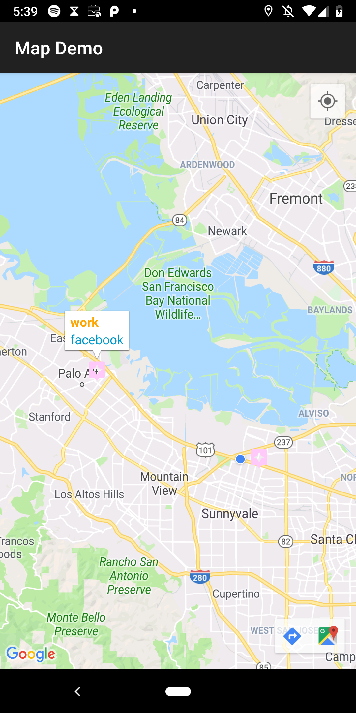

# MapsApp

This app is a simple use of the Google Maps Android API I used to learn this API and play services. This app lets you add markers on any place in th planet with a title and description. In the future I will add the ability to switch from satellite view to regular map view.

(ok)[https://imgur.com/a/HJa51e6]

